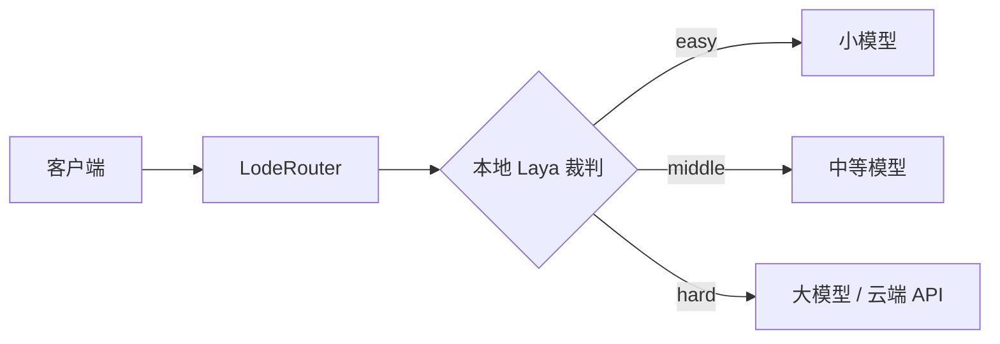

<div align="center">

# LodeRouter

**先判断难度，再挑模型。**

简单问题交给小模型，复杂问题才动用大模型，回答质量不变、推理成本更低。

[](LICENSE)
[]()
[]()

[English](./docs/en/README.md) · [简体中文](./docs/zh-CN/README.md)

</div>

## 工作方式



| 挡位 | 适合的问题 | 后端示例 |
| --- | --- | --- |
| `easy` | 闲聊、查事实、一句话能答 | 本地小模型 |
| `middle` | 多数日常问题、几步就能做完 | 中等模型 |
| `hard` | 多步推理、专业领域、高难度编程 | 大模型 / 云端 API |

三个要点：

- **难度在本地判断** —— Laya 裁判是一个 ONNX 模型，跑在本机，不调用任何模型 API
- **看整段对话，不看最后一句** —— 裁判的输入是整段会话压缩出的概要（256 token 预算）
- **三档可以各走各的** —— 本地 llama.cpp 与云端 API 混用，每一档用自己的 key

## 快速开始

### 1. 编译

```bash
mkdir build && cd build
cmake .. && cmake --build .
```

需要 CMake ≥ 3.20、C++20 编译器、OpenSSL、Threads、onnxruntime。裁判代码来自同目录的 laya 项目，默认 `../laya/cpp`，可用 `-DLAYA_DIR=` 指定。

### 2. 裁判模型（通常不用管）

首次启动时本地没有模型，它会**在后台下载**（约 873 MB），服务立刻就能用；下载期间请求按 `easy` 档处理，模型就绪后自动接管。不需要任何 API Key。

想手动下载、或换成自己的模型？见[裁判模型](./docs/zh-CN/README.md#裁判模型)。

### 3. 配置

```bash
./config_tool    # 问答式生成 ~/.config/LodeRouter/config.json
```

只有一个后端时，手写这几行就够：

```json
{
  "backend_url": "http://127.0.0.1:8088",
  "model_easy": "<小模型名>",
  "model_middle": "<中等模型名>",
  "model_hard": "<大模型名>"
}
```

三档指向不同服务时写 `backends.*`，全部字段见[配置项](./docs/zh-CN/README.md#配置项)。

### 4. 启动，接上客户端

```bash
./LodeRouter    # 默认监听 127.0.0.1:8080
```

把客户端的 `base_url` 指向它、`model` 填 `auto`，`api_key` 随便填（不校验）：

```json
{ "base_url": "http://127.0.0.1:8080", "api_key": "anything", "model": "auto" }
```

各档服务都需要支持 OpenAI 兼容 API。响应以 SSE 透传，客户端记得开启流式接收；每次判定到哪一档、依据了多少上下文，都会写进日志。

## 裁判看到什么

不是最后一句用户消息，而是整段对话压缩出的概要：

```text
[轮次] 第 4 轮
[任务] 再试一次
[报错] 编译报错了：undefined reference to `parse_config'
[约束] 必须保持 ABI 兼容，不能升级依赖
```

所以同一句「hi」，单轮会话判 `easy`，带着「重试 3 次 + 报错」的上下文就判 `middle`。

## 文档

| 文档 | 内容 |
| --- | --- |
| [完整文档（简体中文）](./docs/zh-CN/README.md) | 全部配置项、模型获取方式、日志与启动行为 |
| [Full documentation (English)](./docs/en/README.md) | Everything above, in English |

## 开源协议

[MIT License](LICENSE)
